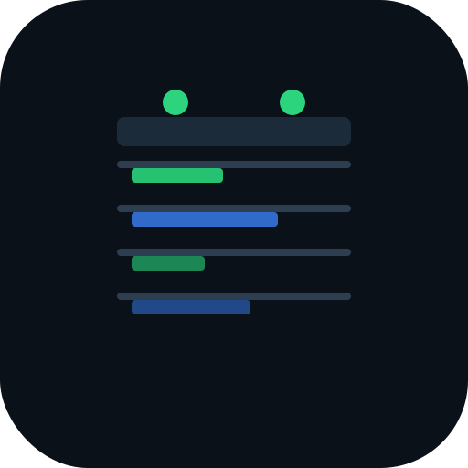

<div align="center">
  
  <h1>Daily Planner</h1>
  <p><strong>A beautifully crafted, modern day planner and life organizer PWA.</strong></p>

  <p>
    <a href="#features">Features</a> •
    <a href="#tech-stack">Tech Stack</a> •
    <a href="#getting-started">Getting Started</a> •
    <a href="#deployment">Deployment</a>
  </p>
</div>

---

## 🌟 Overview

**Daily Planner** is a comprehensive, mobile-first Progressive Web App (PWA) designed to organize your daily life. It features a premium, modern design with smooth micro-animations, glassmorphism, and a meticulously crafted Navy & Mint color palette. The app works offline and uses Firebase Firestore to seamlessly sync your data across all your devices.

Whether you're scheduling tasks, tracking finances, planning your meals, or building daily habits — Daily Planner keeps everything in one elegant dashboard.

## ✨ Features

### 📅 Day & Week Planner
- **Smart Scheduler**: Enter your wake/sleep window, fixed blocks (classes, work), meals, and tasks — the engine fits everything into a conflict-free timeline.
- **Drag to Reorder**: ⠿ grip handles on every task card for intuitive drag-and-drop reordering.
- **Week Overview**: 7-day timeline with goal-hour tracking, progress rings, and stats.
- **Month Calendar**: Click any day to jump directly to its plan.
- **Calendar Export**: Export your schedule to `.ics` for Google/Apple/Samsung Calendar.

### ✅ Habit Tracker
- **Daily Check-offs**: Mark habits done each day with a satisfying tap.
- **Streak Counter**: 🔥 auto-calculated streaks keep you motivated.
- **30-Day Heatmap**: Visual grid showing your consistency over the past month.
- **Cloud-synced**: Habit data persists across devices via Firestore.

### ⏱ Pomodoro Focus Timer
- **25-min focus + 5-min break** cycles, fully controllable.
- **Live progress bar** fills as each phase runs.
- **Session counter** tracks your completed focus blocks.
- **Browser notifications** fire automatically when a phase ends (requires permission).

### 📝 Quick Notes
- **Date-keyed notes**: Each day has its own freeform scratchpad.
- **Day navigation**: ‹ › arrows to browse to any date.
- **Pin notes**: 📌 pin important entries to the sidebar for quick access.
- **Cloud-synced**: Notes persist across devices.

### 🔔 Reminders & Notifications
- **Bell button** in the header requests Web Notifications permission.
- Auto-schedules **5-minute-before alerts** for every fixed block on today's plan.
- Pomodoro phase changes also trigger notifications.

### 🖨️ Print / Save as PDF
- **Printer button** in the header calls `window.print()`.
- Clean `@media print` CSS hides the tab bar, buttons, and UI chrome — only your day plan prints.
- Works natively in every browser with no external library.

### 💰 Finance Tracking
- **Income & Expenses**: Track fixed and variable costs with card-level breakdown.
- **Credit Cards**: Monitor limits and utilization via visual progress bars.
- **Receipt Scanner**: Built-in receipt entry with 8%/10% tax calculation.

### 🍱 Meal & Nutrition Planner
- **Meal Scheduler**: Plan Breakfast, Lunch, Dinner, and Snacks.
- **Nutrition Tracking**: kcal & macros (Protein, Carbs, Fats) per meal.
- **Recipe Library**: Store, import, and pick from structured recipes.
- **Pantry Quantities**: Track what you have; shopping list auto-excludes pantry stock.

### 🛒 Smart Shopping List
- **Checklists**: Tick items off as they go in your basket.
- **Tax Calculation**: Automated 8%/10% pre-tax and post-tax totals.

### 🎨 UI & UX
- **Telegram-style dark mode toggle**: Radial clip-path sweep animation from the button.
- **Floating pill tab bar** with SVG icons and a spring-animated sliding indicator.
- **Active tab label** slides in beside the icon when selected.
- **Swipe left/right** anywhere on the page to switch tabs (mobile).
- **Haptic feedback** (6ms vibration) on every tab tap.
- **Panel slide animation** on tab switch.
- **Multi-language**: English, Japanese (日本語), Vietnamese (Tiếng Việt).
- **Custom UI controls**: No native date/time pickers — all replaced with bespoke scroll wheels and date pickers matching the app design.

### ⚡ PWA & Offline Support
- Fully installable Progressive Web App.
- **Service Worker** caching for offline access.
- Network-first HTML, stale-while-revalidate for assets.

## 🛠️ Tech Stack

- **Frontend**: HTML5, Vanilla JavaScript (ES Modules), Custom CSS — no frameworks, no build step.
- **Architecture**: Modular JS (`app.js`, `finance.js`, `shopping.js`, `meals.js`, `schedule.js`, `week.js`, `calendar.js`, `fx.js`, `i18n.js`).
- **Backend & Sync**: Firebase Auth (Google sign-in) + Firestore (v11 Modular SDK).
- **Security**: CSP with no `unsafe-inline` scripts; `esc()` for all innerHTML; `safeUrl()` for imported URLs.
- **Testing**: Native Node.js test runner — `node --test tests/*.test.mjs` (222 tests, all pure module).
- **Deployment**: GitHub Pages.

## 🚀 Getting Started

### Prerequisites
- A modern web browser.
- A Firebase project with Firestore enabled (optional — app falls back to localStorage).

### Local Setup
1. **Clone the repository:**
   ```bash
   git clone https://github.com/Manojx2005/DailyPlanner.git
   cd DailyPlanner
   ```
2. **Configure Firebase (optional but recommended for sync):**
   Copy `config.example.js` to `firebase-config.js` and fill in your project config:
   ```javascript
   export const firebaseConfig = {
     apiKey: "YOUR_API_KEY",
     authDomain: "YOUR_AUTH_DOMAIN",
     projectId: "YOUR_PROJECT_ID",
     storageBucket: "YOUR_STORAGE_BUCKET",
     messagingSenderId: "YOUR_MESSAGING_SENDER_ID",
     appId: "YOUR_APP_ID"
   };
   ```
3. **Run locally:**
   ES modules require an HTTP server — not `file://`:
   ```bash
   npx serve .
   ```
   Open `http://localhost:3000`.

4. **Run tests:**
   ```bash
   node --test tests/*.test.mjs
   ```

## 🌐 Deployment

Static client-side app — deploy anywhere. GitHub Pages is preconfigured.

Firestore rules can be deployed separately:
```bash
firebase deploy --only firestore
```

## 📄 License

MIT License — see the LICENSE file for details.
